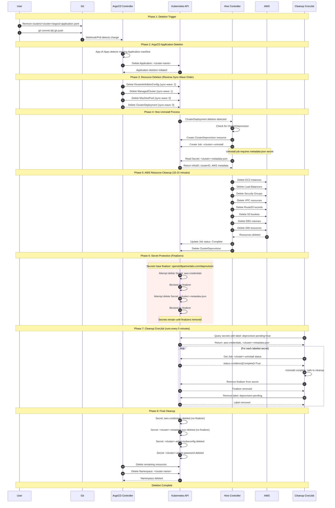

# Cluster Deletion Workflow

This diagram visualizes the complete cluster deletion process from trigger to completion.

## Key Components

| Component | Role |
|-----------|------|
| **Git Repository** | Source of truth for cluster state |
| **ArgoCD App-of-Apps** | Discovers and manages cluster Applications |
| **ArgoCD Controller** | Syncs desired state, handles deletion |
| **Hive Controller** | Manages ClusterDeployment lifecycle |
| **Uninstall Job** | Destroys AWS infrastructure |
| **Cleanup CronJob** | Removes finalizers after uninstall completes |

## Finalizer Protection

The finalizers on `aws-credentials` and `<cluster>-metadata-json` secrets ensure:

1. Secrets are not deleted before uninstall job runs
2. Uninstall job has access to AWS credentials and cluster metadata
3. AWS resources are properly cleaned up before secrets are removed

## Timing

| Phase | Duration |
|-------|----------|
| ArgoCD detection | 1-3 minutes |
| Resource deletion trigger | < 1 minute |
| AWS cleanup | 10-15 minutes |
| CronJob cleanup | Up to 5 minutes (next scheduled run) |
| **Total** | **15-25 minutes** |
